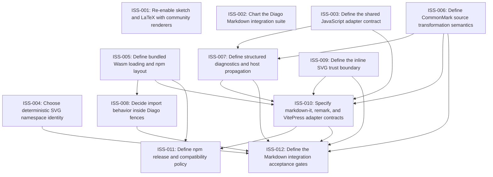

# Markdown Issue Index

Generated by derive-tracker.wasm

## Ready Queue

| ID | Priority | Type | Assignee | Title | Labels |
| --- | ---: | --- | --- | --- | --- |
| [ISS-003](ISS-003.md) | 1 | feature | unassigned | Define the shared JavaScript adapter contract | wayfinder:grilling, markdown, api, javascript |
| [ISS-004](ISS-004.md) | 1 | feature | unassigned | Choose deterministic SVG namespace identity | wayfinder:prototype, markdown, renderer-svg, determinism |
| [ISS-006](ISS-006.md) | 1 | feature | unassigned | Define CommonMark source transformation semantics | wayfinder:prototype, markdown, commonmark, source-ranges |
| [ISS-008](ISS-008.md) | 2 | feature | unassigned | Decide import behavior inside Diago fences | wayfinder:grilling, markdown, imports, wasm |

## Unresolved Issues

| ID | Status | Priority | Type | Assignee | Blocked by | Blocks | Title |
| --- | --- | ---: | --- | --- | --- | --- | --- |
| [ISS-002](ISS-002.md) | in_progress | 1 | epic | codex | none | none | Chart the Diago Markdown integration suite |
| [ISS-003](ISS-003.md) | open | 1 | feature | unassigned | none | ISS-007, ISS-010 | Define the shared JavaScript adapter contract |
| [ISS-004](ISS-004.md) | open | 1 | feature | unassigned | none | ISS-012 | Choose deterministic SVG namespace identity |
| [ISS-006](ISS-006.md) | open | 1 | feature | unassigned | none | ISS-007, ISS-010, ISS-012 | Define CommonMark source transformation semantics |
| [ISS-007](ISS-007.md) | open | 1 | feature | unassigned | ISS-003, ISS-006 | ISS-010, ISS-012 | Define structured diagnostics and host propagation |
| [ISS-010](ISS-010.md) | open | 1 | feature | unassigned | ISS-003, ISS-006, ISS-007 | ISS-011, ISS-012 | Specify markdown-it, remark, and VitePress adapter contracts |
| [ISS-012](ISS-012.md) | open | 1 | task | unassigned | ISS-004, ISS-006, ISS-007, ISS-008, ISS-010 | none | Define the Markdown integration acceptance gates |
| [ISS-008](ISS-008.md) | open | 2 | feature | unassigned | none | ISS-012 | Decide import behavior inside Diago fences |
| [ISS-011](ISS-011.md) | open | 2 | chore | unassigned | ISS-010 | none | Define npm release and compatibility policy |
| [ISS-001](ISS-001.md) | deferred | 4 | chore | unassigned | none | none | Re-enable sketch and LaTeX with community renderers |

## Dependency Graph

## Warnings

None.
