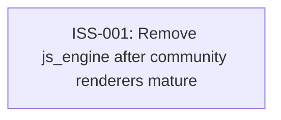

# Markdown Issue Index

Generated by derive-tracker.wasm

## Ready Queue

No ready issues.

## Unresolved Issues

| ID | Status | Priority | Type | Assignee | Blocked by | Blocks | Title |
| --- | --- | ---: | --- | --- | --- | --- | --- |
| [ISS-001](ISS-001.md) | deferred | 4 | chore | unassigned | none | none | Remove js_engine after community renderers mature |

## Dependency Graph

## Warnings

None.
